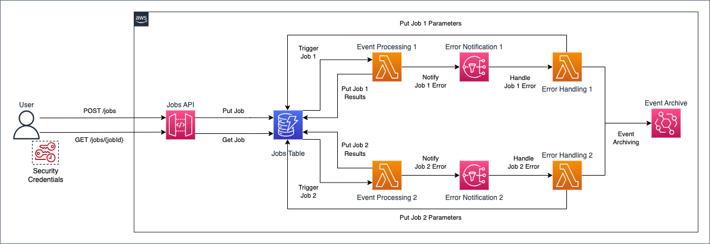

# Asynchronous Processing with API Gateway and DynamoDB Streams

## Architecture



A typical workflow looks as following:

1. The user authenticates against AWS Identity and Access Management (IAM) and obtains security credentials
2. The user does an HTTP POST request to the `/jobs` jobs API endpoint, specifying in the request body the job parameters
3. The jobs API returns to the user an HTTP response containing the job identifier
4. The jobs API Gateway DynamoDB integration creates an item containing the input parameters for the job
5. The event processing function is triggered by the DynamoDB insert operation and processes the event, then puts the job results in the jobs Amazon DynamoDB table
6. The user does an HTTP GET request to the `/jobs/{jobId}` jobs API endpoint, with the job identifier from step 3. as `{jobId}`
7. The jobs API queries the jobs table to retrieve the job results
8. The jobs API returns to the user an HTTP response containing the job results

If the event processing fails:

1. The event processing function sends the event to the error handling function
2. The error handling function puts the job parameters in the jobs Amazon DynamoDB table
3. The user can retrieve the job parameters by doing an HTTP GET request to the `/jobs/{jobId}` jobs API endpoint

If the error handling fails:

1. The error handling function sends the event to an Amazon EventBridge archive
2. The user can replay the archived events by using the related Amazon EventBridge feature


## Prerequisites
Install on your workstation the following tools:
- [AWS CDK Toolkit](https://docs.aws.amazon.com/cdk/v2/guide/cli.html) version `2.85.0`;
- [Node.js](https://nodejs.org/en/download/) version `18.13.0`;
- [Projen](https://pypi.org/project/projen/) version `0.71.111`.
## Setup
Execute the following steps on your workstation:
- clone this repository:
```bash
git clone git@ssh.gitlab.aws.dev:meronian/aws-asynchronous-processing-api-gateway-dynamodb-streams-cdk.git
```
- change directory to the repository's root:
```bash
cd aws-asynchronous-processing-api-gateway-dynamodb-streams-cdk
```
- setup the project using [Projen](https://github.com/projen/projen):
```bash
npx projen
```
- activate the [Python's virtual environment](https://docs.python.org/3/library/venv.html):
```bash
source .env/bin/activate
```
- **\[AWS ProServe only\]**: **temporarily** disable [Code Defender](https://codedefender.proserve.aws.dev/):
```bash
sudo git config --edit --system
...
#[core]
#        hooksPath = /usr/local/lib/git-defender/hooks
...
```
- install the [pre-commit](https://pre-commit.com/) hooks:
```bash
pre-commit install
pre-commit install --hook-type commit-msg
```
- **\[AWS ProServe only\]**: re-enable [Code Defender](https://codedefender.proserve.aws.dev/):
```bash
sudo git config --edit --system
...
[core]
        hooksPath = /usr/local/lib/git-defender/hooks
...
```

## Test

To run the project tests execute:

```bash
npx projen test
```

## Lint

To lint the project code execute:

```bash
npx projen synth
npx projen lint
```

## Scan

To perform a security scan of the project code execute:

```bash
npx projen synth
npx projen scan
```

## Release

Execute the following steps on your workstation:

- change the value of `__version__` in `.projenrc.py` (follow [PEP440](https://peps.python.org/pep-0440/) specification)

```python
...
__version__ = "0.1.0"
...
```

- update [Projen](https://github.com/projen/projen)'s task definitions:

```bash
npx projen
```

- release a new version using [Projen](https://github.com/projen/projen):

```bash
npx projen release
```

- push to remote, including tags:

```bash
git push
git push --tags
```

## Bootstrap
To bootstrap the [AWS CDK](https://aws.amazon.com/cdk/) in your target account execute:
```bash
AWS_PROFILE=$YOUR_AWS_PROFILE npx projen bootstrap
```

## Deployment

To deploy your application in your target account execute:

```bash
AWS_PROFILE=$YOUR_AWS_PROFILE npx projen deploy
```

## Cleanup

To cleanup your application in your AWS account execute:

```bash
AWS_PROFILE=$YOUR_AWS_PROFILE npx projen destroy
```

## Try it out

To try the sample architecture included in this repository proceed to:

- Perform a [deployment](#deployment) in your AWS account
- Install on your workstation the [AWS Command Line Interface (CLI)](https://docs.aws.amazon.com/cli/latest/userguide/getting-started-install.html)
- [Assume](https://awscli.amazonaws.com/v2/documentation/api/latest/reference/sts/assume-role.html) the `JobsAPIInvokeRole` printed as output from the deploy command
- Install [Postman](https://www.postman.com/downloads/) on your workstation
- [Import](https://learning.postman.com/docs/getting-started/importing-and-exporting-data/) the [Postman collection](./postman_collection.json) included in this repository
- [Set](https://learning.postman.com/docs/sending-requests/variables/) the `JobsAPI` variables as following:
  - `accessKey`: value of the `Credentials.AccessKeyId` attribute from the `assume-role` command
  - `baseUrl`: value of the `JobsApiJobsAPIEndpoint` output from the deploy command **without trailing slash**
  - `region`: value of the [AWS Region](https://docs.aws.amazon.com/AWSEC2/latest/UserGuide/using-regions-availability-zones.html#concepts-regions) where you deployed the sample architecture
  - `seconds`: the value of the input parameter for the sample job. It must be a positive integer
  - `secretKey`: value of the `Credentials.SecretAccessKey` attribute from the `assume-role` command
  - `sessionToken`: value of the `Credentials.SessionToken` attribute from the `assume-role` command
- Test the sample architecture by [sending requests](https://learning.postman.com/docs/sending-requests/requests/#next-steps) to the jobs API

## Security

See [CONTRIBUTING](CONTRIBUTING.md#security-issue-notifications) for more information.

## License

This library is licensed under the MIT-0 License. See the LICENSE file.
